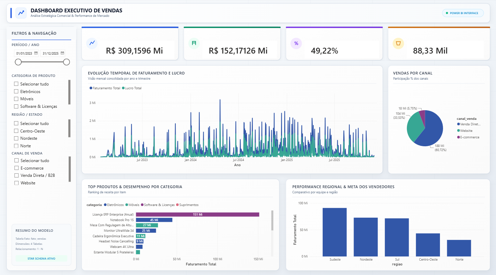

# 📊 Dashboard Executivo de Vendas — Power BI


> ⚠️ **Aviso Importante:** Todos os dados, métricas e informações contidos neste projeto são **100% fictícios**. Este repositório foi desenvolvido estritamente para uso pessoal, fins de estudo e composição de portfólio profissional.

Um dashboard completo e interativo desenvolvido no **Power BI**, projetado para análise estratégica comercial, acompanhamento de faturamento, margem de lucro, comportamento de canais de venda e desempenho da equipe comercial.

O projeto utiliza **Modelagem Dimensional Star Schema** (Modelo Estrela) de alta performance e inclui uma interface visual vetorizada customizada em **SVG** (em versões Tema Claro e Tema Escuro).

---

## 🖼️ Demonstração do Dashboard



---

## 🎯 Objetivos & Indicadores (KPIs)

O painel foi construído para responder às principais perguntas de negócio de uma operação comercial:

- **Faturamento Total & Bruto**: Acompanhamento de receita consolidada e deduções de descontos.
- **Lucratividade & Margem %**: Avaliação de custo total de mercadoria vendida (CMV) e retorno percentual sobre vendas.
- **Volume de Vendas & Ticket Médio**: Total de pedidos finalizados e valor médio por transação.
- **Vendas por Canal**: Distribuição percentual da receita entre Website, E-commerce, Venda Direta/B2B e Parceiros.
- **Desempenho por Categoria & Produto**: Ranking dos produtos mais vendidos e categorias mais rentáveis.
- **Análise Regional & Vendedores**: Comparativo de atingimento de metas individuais e desempenho por regiões e estados.
- **Inteligência de Tempo (Time Intelligence)**: Comparativos Ano a Ano (YoY), faturamento acumulado no ano (YTD) e no mês (MTD).

---

## 🏗️ Arquitetura de Dados (Star Schema)

A modelagem de dados foi desenhada no padrão **Star Schema (Modelo Estrela)**, garantindo otimização na performance de consultas DAX, facilidade de manutenção e escalabilidade.

```
          +-----------------------+
          |     dim_clientes      |
          +-----------------------+
                      | 1
                      |
                      | N
+------------------+  |  +-------------------+  N  1 +------------------+
|  dim_produtos    |--+--|    fato_vendas    |-------|  dim_vendedores  |
+------------------+ 1  N +-------------------+       +------------------+
                                  | N
                                  |
                                  | 1
                          +---------------+
                          | dim_calendario|
                          +---------------+
```

### 📋 Estrutura das Tabelas

#### 1. Tabela Fato (`fato_vendas`)
Armazena os eventos transacionais de vendas da empresa.
- **Campos**: `id_venda`, `data_venda`, `id_cliente`, `id_produto`, `id_vendedor`, `quantidade`, `preco_unitario`, `desconto_pct`, `valor_total`, `custo_total`, `lucro_total`, `margem_lucro_pct`, `canal_venda`.

#### 2. Tabelas Dimensão (`dim_*`)
- **`dim_produtos`**: Cadastro de itens comercializados (`id_produto`, `nome_produto`, `categoria`, `subcategoria`, `preco_tabela`, `custo_base`).
- **`dim_clientes`**: Cadastro de clientes B2B e B2C (`id_cliente`, `nome_cliente`, `tipo_cliente`, `segmento`, `cidade`, `estado`, `regiao`).
- **`dim_vendedores`**: Cadastro de vendedores e equipes (`id_vendedor`, `nome_vendedor`, `equipe`, `regional`, `meta_mensal`).
- **`dim_calendario`**: Tabela dCalendario completa (`data`, `ano`, `mes`, `nome_mes`, `ano_mes`, `trimestre`, `semestre`, `dia_semana`, `fim_de_semana`).

---

## 📐 Principais Medidas DAX

Todas as métricas do relatório são calculadas via DAX dinâmico. Abaixo estão algumas das principais fórmulas utilizadas:

### Receita & Lucratividade
```dax
// Faturamento Total
Faturamento Total = SUM(fato_vendas[valor_total])

// Lucro Total
Lucro Total = SUM(fato_vendas[lucro_total])

// Margem %
Margem % = DIVIDE([Lucro Total], [Faturamento Total], 0)
```

### Volume & Ticket Médio
```dax
// Total de Pedidos Únicos
Total Pedidos = DISTINCTCOUNT(fato_vendas[id_venda])

// Ticket Médio
Ticket Médio = DIVIDE([Faturamento Total], [Total Pedidos], 0)
```

### Análise por Canal
```dax
// Share % de Faturamento por Canal
% Faturamento por Canal = 
DIVIDE(
    [Faturamento Total],
    CALCULATE([Faturamento Total], ALL(fato_vendas[canal_venda])),
    0
)
```

### Inteligência de Tempo (Time Intelligence)
```dax
// Comparativo Ano Anterior (Same Period Last Year)
Faturamento Ano Anterior (LY) = 
CALCULATE(
    [Faturamento Total],
    SAMEPERIODLASTYEAR(dim_calendario[data])
)

// Crescimento % Ano a Ano
Crescimento YoY % = 
DIVIDE(
    [Faturamento Total] - [Faturamento Ano Anterior (LY)],
    [Faturamento Ano Anterior (LY)],
    0
)
```

---

## 🎨 Design & Layout SVG

A interface do relatório foi projetada em **vetor SVG em alta resolução (1920x1080 - 16:9)** para ser importada como tela de fundo (*Canvas Background*) no Power BI.

O layout conta com duas versões limpas para escolha do usuário:
- **Tema Claro (`background_light_v2.svg`)**: Design limpo e corporativo.
- **Tema Escuro (`background_dark_v2.svg`)**: Estilo moderno Executive Dark.

### 🎨 Paleta de Cores (Tema Claro)

| Elemento | Código HEX | Aplicação |
| :--- | :---: | :--- |
| **Fundo da Tela** | `#F8FAFC` | Fundo principal da página |
| **Fundo dos Cards** | `#FFFFFF` | Containers de gráficos e KPIs |
| **Bordas & Divisores** | `#E2E8F0` | Linhas de divisão sutis |
| **Texto Principal** | `#0F172A` | Títulos e valores em destaque |
| **Texto Secundário** | `#64748B` | Subtítulos e eixos dos gráficos |
| **Destaque Azul** | `#2563EB` | Faturamento / Métricas principais |
| **Destaque Verde** | `#059669` | Lucro Líquido / Resultados positivos |
| **Destaque Roxo** | `#7C3AED` | Margem de Lucro % |
| **Destaque Laranja** | `#D97706` | Ticket Médio & Pedidos |

---

## 📂 Estrutura de Arquivos do Repositório

```bash
├── dash.pbix                    # Arquivo do relatório Power BI
├── fato_vendas.csv              # Tabela Fato de Vendas (3.500 registros)
├── dim_produtos.csv             # Dimensão de Produtos
├── dim_clientes.csv             # Dimensão de Clientes
├── dim_vendedores.csv           # Dimensão de Vendedores
├── dim_calendario.csv           # Dimensão Calendário (2023 a 2025)
├── medidas_dax.dax              # Arquivo contendo todas as medidas DAX
├── medidas_dax.txt              # Medidas DAX em texto simples
├── background_light_v2.svg      # Background visual limpo (Tema Claro)
├── background_dark_v2.svg       # Background visual limpo (Tema Escuro)
├── assets/
│   └── image.png                # Imagem de demonstração do dashboard
└── README.md                    # Documentação do projeto
```

---

## 🚀 Como Utilizar este Projeto

1. **Baixe ou clone o repositório**:
   ```bash
   git clone https://github.com/LucasPPontes/dashboard_vendas.git
   ```
2. **Abrir o arquivo no Power BI Desktop**:
   - Abra o arquivo `dash.pbix` diretamente no **Power BI Desktop**.
3. **Reconectar os Dados (caso necessário)**:
   - Se o Power BI solicitar a atualização dos arquivos fonte, vá em **Transformar Dados** > **Configurações da Fonte de Dados** e selecione o caminho local onde salvou as tabelas `.csv`.
4. **Importar / Alterar a Tela de Fundo (SVG)**:
   - Na guia **Formatar tela do relatório** (ícone de Pincel na lateral direita) > **Fundo da página**.
   - Selecione a imagem `background_light_v2.svg` ou `background_dark_v2.svg`.
   - Ajuste a **Transparência** para `0%` e o **Ajuste da Imagem** para `Preencher` (*Fit/Fill*).

---

## 👤 Autor


Desenvolvido por **Lucas Pontes**  
Portfólio de Business Intelligence e Engenharia de Dados.

